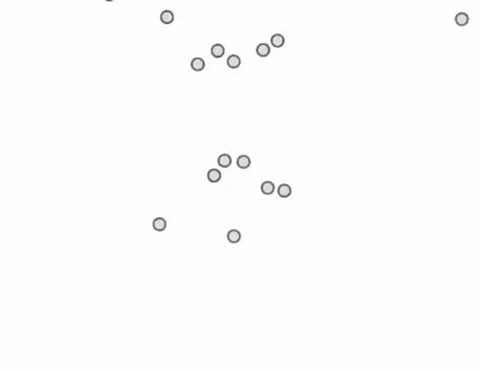

# d3-force-gravity [](https://travis-ci.org/sohamkamani/d3-force-gravity) [](https://coveralls.io/github/sohamkamani/d3-force-gravity?branch=master) [](https://badge.fury.io/js/d3-force-gravity)

> Implement gravitational attraction (or force-field-like repulsion) using d3-force



Go [here](http://www.sohamkamani.com/d3-force-gravity__demo/) for a live demo and [here](https://github.com/sohamkamani/d3-force-gravity__demo/blob/master/src/index.js) for the code used in the demo

## Installation

Using npm :

```
$ npm install --save d3-force-gravity
```

If you want to use this directly on your browser, use the contents of `d3-force-gravity.min.js`, or, include this script after the [d3 library](http://d3js.org) in your HTML file :

```html
<script src="https://raw.githubusercontent.com/sohamkamani/d3-force-gravity/master/d3-force-gravity.min.js" charset="utf-8"></script>
```

## Usage

__Using npm :__

```js
const width = 200
const height = 400

//First, require the module
const forceGravity = require('d3-force-gravity')

//Add it to your d3 force simulation, just like other forces
d3.forceSimulation()
	.force('gravity', forceGravity(width/2, height/2))
```

__Using directly in the browser :__

1. Follow installation steps above, and include the appropriate script.
2. This force will be made available on `d3.forceGravity`.
3. Be sure to include the d3 library _first_

## Documentation

#### __forceGravity__([x, y])

Creates a new gravitational force centered on the coordinates `x` and `y`.

Defaults :  
```
x : 0  
y : 0
```

Returns a new `gravity` force

#### _gravity_.__strength__([strength])

If `strength` is specified, sets the strength of the force to its value, and returns the force.  

If it is not specified, returns the current value of the forces strength.

If the strength is negative, it will lead to replusion of all nodes from the center of the force.

Default : 10000

#### _gravity_.__minRadius__([minRadius])

The minimum radius outside of which this force is applied. Any node closer in distance to the center than this value, is not affected by the force. This is to prevent the enormous amount of force that would result from particles getting too close (tending to infinity at the center)

If `minRadius` is specified, sets the minRadius of the force to its value, and returns the force.  

If it is not specified, returns the current value of the forces minRadius.

Default : 40

#### _gravity_.__x__([x])

Set the x coordinate of the center of the force.

If `x` is specified, sets the x coordinate of the force to its value, and returns the force.  

If it is not specified, returns the current value of the forces x coordinate.

#### _gravity_.__y__([y])

Set the y coordinate of the center of the force.

If `y` is specified, sets the y coordinate of the force to its value, and returns the force.  

If it is not specified, returns the current value of the forces y coordinate.

## License

MIT © [sohamkamani](https://github.com/sohamkamani)
